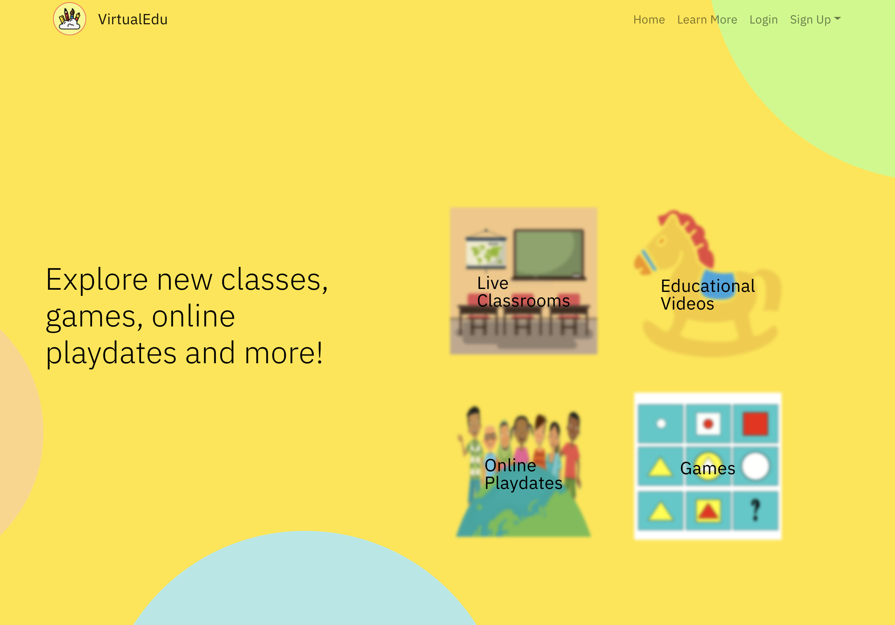

# Covid9Team-NAInternHackathon

This is the readme file for our Covid9Team for the project on theme "Covid19".(a little pun here;) in case you didn't notice)

Problem Statement: - Due to Covid-19 situation, all of us are working from home. Its not very easy to work from home when you have children. Children need attention and care when you are working and are not able to look at them.

To solve this issue, we have built a platform which keeps children engaged in learning and some fun stuff. The platfrom also contains functions like live video streaming through which the students are connected to other students and care takers. Children can also look at learning and fun videos.
It is different and better than the existing websites because it provides a single platform where children and teachers can signup. Teachers can take one on one sessions with children. Teachers and Parents can also meet via the live streaming platform to give feedbacks about the children. It also allows to make match between children. We know that children like to spend time with the ones of their age. So, using our platform, the children get matched to other children via the Playdates feature. Children can also play games and watch recorded videos.

Main functionalies of our product: Live Peer to Peer video streaming, Playdates, Events Signup, Teacher and Parents Signup, Games, recorded learning and fun videos streaming.
In our homepage, you can choose to sign up as a parent or as a teacher. All your information is safely stored in IBM Cloud (Cloundant). 

Then join class/ learn more will lead you to our exicting selection of services.

In live classrooms, you can sign up for your kid to attend an interactive class, geograph class for example.

In educational videos, it contains different level of informative recorded videos. Have fun watching!

We also have online playdates service so kids can have some face-to-face time with fellow friends. And who doesn't want some game!

###
    Technologies used
HTML, CSS, React.js, IBM Cloud (Cloundant), Google Calendar API, Simple Peer (for peer to peer live streaming via RTC).

###
    Main directories
src: contains the code files, assets, stream and server.
stream: contains the work for peer to peer live videos.
server: contains the backend part implemented using IBM Cloud.
second-server: contains calendar api backend.

###
    Future
In the future, we will set up the server on the cloud to help it scale. As more teachers join, we will have more interactive classes to choose from.
We will look for other game/recorded classes material or partner with other website.
So that our platform can fulfill all needs when coming to parenting a kid online!

